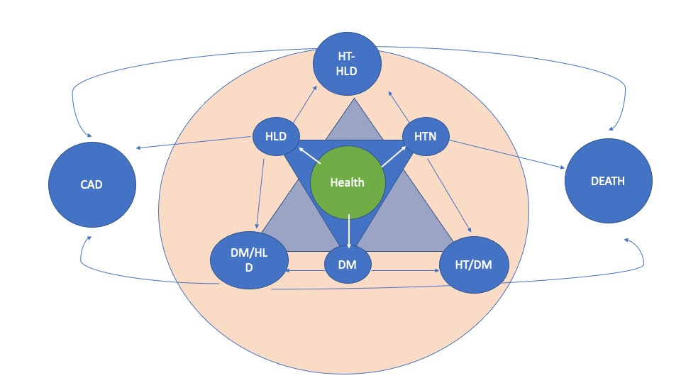
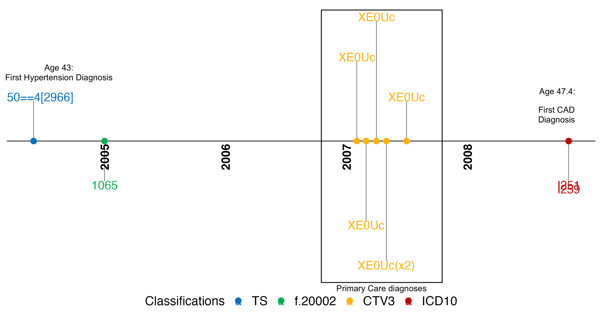
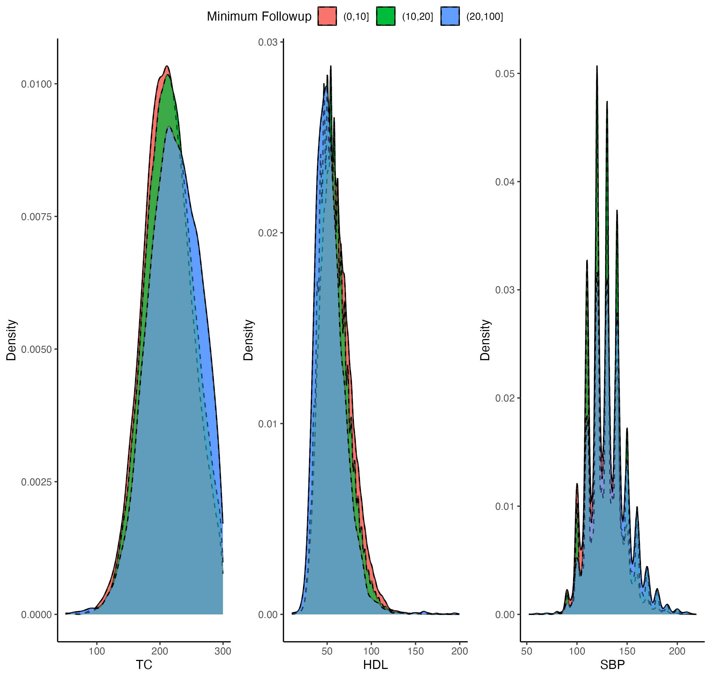
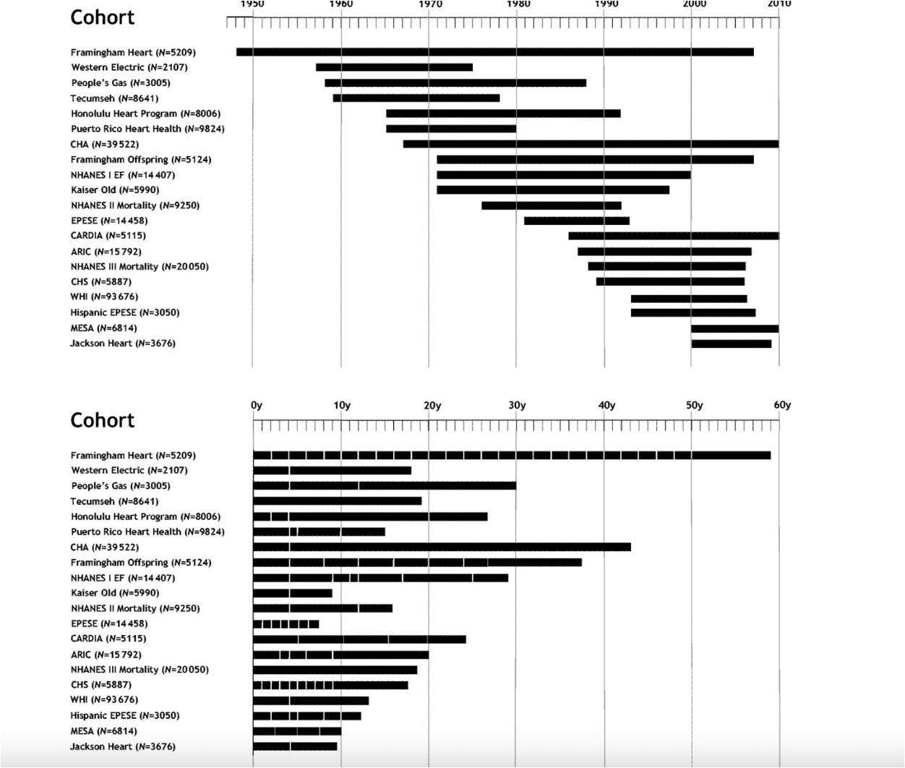
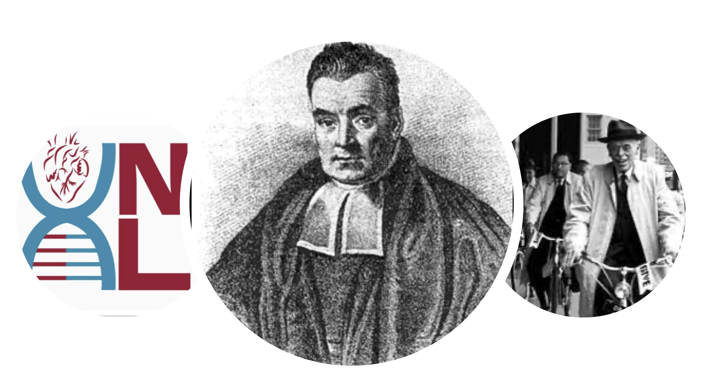

```{r setup, include=FALSE}
knitr::opts_chunk$set(echo = FALSE,warning = F,message = F)
```

```{r}
setwd("~/multistate/")
library("data.table")
source('code/fullarray.R')
source('~/multistate/newsmooth.R')
source('code/plotcode.R')
source('code/fitarray.R')
source('code/ses.R')
library(ggplot2)
library(grid)
library(gridExtra)
library(RColorBrewer)
library(dplyr)
library(purrr)
library(tidyr)
library(plotly)
```

## Life transitions

People are complicated. Look at this transition through lifestages for an individual based on diagnostic codes, lab data, and biomarkers. 

```{r, out.width= "500px", echo=FALSE}
knitr::include_graphics("docs/assets/pheno_output.png")
```

## Lifetime risk

Previously, authors have soguth to capture static lifetime risk

```{r, out.width= "500px", echo=FALSE}

knitr::include_graphics("~/Dropbox/lifecvd.png")
```

## What we know

Time matters!

```{r, out.width= "1000px", echo=FALSE}
knitr::include_graphics("~/dynamichr/Figs/combined456.png")
```


## So what should we do?

* Time dependency 
** Likelihoods: double the trouble?

```{r pressure,eval=T,echo=F}
m=readRDS("~/Dropbox/pheno_dir/output/mos_longitudinal_sbp_ldl_cad.rds")
head(m[c(20:30),])
```

## Time dependent challenges


```{r,echo=TRUE,eval=F}
fit1=coxph(Surv(tstart,Cad_0_censor_age,Cad_0_Any)~cad.prs:timegroup+
             ldl:timegroup+sbp:timegroup+bmi:timegroup+
             h1c:timegroup+stat:timegroup+sex:timegroup,data=mos)
```

```{r,echo=FALSE,eval=T}
fit1=readRDS("~/Dropbox/fit1withstatin.rds")
c=coefficients(fit1)[1:45]
v=sqrt(diag(fit1$var))[1:45]
li=exp(c-qnorm(0.975)*v)
ui=exp(c+qnorm(0.975)*v)

variable=c(rep("cad.prs",9),rep("ldl.timedep",9),rep("sbp.timedep",9),rep("bmi.timedep",9),rep("h1c.timedep",9))
age_of_event=rep(c("0-40","40-45","45-50","50-55","55-60","60-65","65-70","70-75","75+"),5)
df=data.frame(est=exp(c),ui=ui,li=li,var=variable,age_of_event=age_of_event)

#d2=df[-which(df$var=="sex.time"),]
ggplotly(ggplot(df, aes(x=age_of_event,y=est,color=var,group=var,fill=var))+geom_errorbar(aes(ymin=ui, ymax=li), width=.1)+stat_smooth(method="loess")+geom_point()+labs(y="exp(B(x(t))",title = "TDS Term",col="Variable")+theme_classic(base_size = 15))
```

## Attempt 2

```{r,echo=T,eval=F}
mos$lipidadj=ifelse(mos$stat==1,mos$ldl/0.7,mos$ldl)
fit1=coxph(Surv(tstart,Cad_0_censor_age,Cad_0_Any)~cad.prs:timegroup+lipidadj:timegroup+sbp:timegroup+bmi:timegroup+h1c:timegroup+sex:timegroup,data=mos)
```

```{r,eval=T,echo=F}
fit1=readRDS("~/Dropbox/fit1_withoutstatin.rds")
c=coefficients(fit1)[1:45]
v=sqrt(diag(fit1$var))[1:45]
li=exp(c-qnorm(0.975)*v)
ui=exp(c+qnorm(0.975)*v)

variable=c(rep("cad.prs",9),rep("ldl.timedep",9),rep("sbp.timedep",9),rep("bmi.timedep",9),rep("h1c.timedep",9))
age_of_event=rep(c("0-40","40-45","45-50","50-55","55-60","60-65","65-70","70-75","75+"),5)
df=data.frame(est=exp(c),ui=ui,li=li,var=variable,age_of_event=age_of_event)

#d2=df[-which(df$var=="sex.time"),]
ggplotly(ggplot(df, aes(x=age_of_event,y=est,color=var,group=var,fill=var))+geom_errorbar(aes(ymin=ui,ymax=li), width=.1)+stat_smooth(method="loess")+geom_point()+labs(y="exp(B(x(t))",title = "TDS Term",color="Variable")+theme_classic(base_size = 15)+guides(fill="none"))
```

## People are different!

-- note the distribution of PRS risk by age of initiation
-- lag effects of medication, time-dependent confounding !
-- how can we account for age dependent effects without error prone biometric data

```{r, out.width= "700px", echo=FALSE}
knitr::include_graphics("~/Desktop/peoplediff.png")
```


## Solution! Multistate modeling

We can think of these life transitions as progressing through a variety of states:

```{r, out.width= "700px", echo=FALSE}

```

## Markov

Two clocks: time and duration

* `Markov`: transition depends only on current state
* `Time-inhomogenous`: the time until the next health event (healthy, ill, dead) is allowed to depend on the current health state of the individual (health, ill, dead) and his age (time). 
* `Time homogenous semi markov`: the time until the next health event is allowed to depend on the current health state of the individual and the time since he entered this state of health (duration). 


## Timeline

```{r, out.width= "1000px", echo=FALSE}

```

## Error prone biometric data: Not our phenotyping

```{r, out.width= "1000px", echo=FALSE}
knitr::include_graphics("~/multistate/PN_76.png")
```

## But overall ...

```{r, out.width= "1000px", echo=FALSE}
knitr::include_graphics("~/multistate/butforall.png")
```


## More measurements

```{r, out.width= "1000px", echo=FALSE}
knitr::include_graphics("~/multistate/numberofmeasurements.png")
```


## Sketch

* You can't escape the island! 
* Buckets of risk: you're in until you're not 

```{r, out.width= "1000px", echo=FALSE}
knitr::include_graphics("~/multistate/island.png")
```

## Overview

```{r, out.width= "800px", echo=FALSE}
knitr::include_graphics("~/multistate/table1.png")
```

## Advantages of multistate

```{r,fig.height=4,fig.width=4}
library(plotly)
ggplotly(readRDS("output/numbertransplot.rds"))
```
* `time dependent` state vs `time invariant` predictors
* inhomogenous != memoryless
* condition on new state with *flexible* fits between states

## Distribution of states

* Fix end: examine cumulative one-step transitions

```{r}
n=readRDS("~/multistate/cnar.rds")
ggplotly(n)
```

## Considerations

* How do we dynamically compare (i.e. update PCE)
* Across risk factor states
* Compare over all ages vs at each age
* Over all ages, MSGene augments young vs old
* At each age, high genetic risk w/o traditional risk factors

## Under the hood:

**Giant array**

```{r,echo=F,eval=T}
head(fitfunc)
fixedsmoke=readRDS("output/fixedsmoke.rds")
attributes(fixedsmoke)
fixedsmoke$model_list[["40"]][["Cad"]][["Health"]]
```


## Avoids the need for longform data frame

* `Atrisk` in wide form

```{r, echo=T,eval=F,size=0.8}
atrisk = df_frame[age < Cad_0_censor_age &
                        age < Ht_0_censor_age &
                        age < HyperLip_0_censor_age &
                        age < Dm_0_censor_age &
                        age < Death_Censor_Age, ]
    atrisk$statin_now = ifelse(atrisk$statin == 1 &
                                 atrisk$statin_age <= nx, 1, 0)
    atrisk$antihtn_now = ifelse(atrisk$antihtn == 1 &
                                  atrisk$htn_age <= nx, 1, 0)
    
```


## Under the hood continued ...

* `censored` and `modelfit` for your choice of covariates (can include `timeinstate`)
* `newlist` = user specified covariates

```{r, echo=T,eval=F,size=0.8}
censored = dim(atrisk[which(Cad_0_censor_age <= nx &
                                    Cad_0_Any == 2 &
                                    nx < Death_Censor_Age
                                    ), ])[1]
      nar[i, "Cad", 1] = NAR
      event[i, "Cad", 1] = censored
      mean[i, "Cad", 1] = censored / NAR
      
      rm(censored)
      fit2 = glm(
        family = mode,as.formula(paste0("
        ifelse(
          Cad_0_censor_age <= nx &
            Cad_0_Any == 2 & nx < Death_Censor_Age,
          1,
          0
        ) ~", new_list)),
        ## here age represents time in state
        data = atrisk
      )
      agelist[[agename]][["Cad"]][["Health"]] =summary(fit2)$coefficients

```

## simple matrix multiplication

* Per year of transitioning from state to *j* to *k* for *i* (if `ChatGPT` can do it...)

$$\pi_{i,j,k}=\frac{\exp{{X_{i...p}}{\beta_{p}}}}{1+\exp{{X_{i...p}}{\beta_{p}}}}$$


* Cumulative risk for a given individual of progressing to state $k$ from state $j$ any N-year period ranging from $X$ to $Y$ is: 

$$\begin{equation}
   1-\prod_{x=X}^{Y}(1-\pi_{x,j,k})
\end{equation}$$


## simple matrix multiplication


* Lifetime risk for an individual of progressing to state $k$ from state $j$ where L is the maximum age of life and $a$ is the currently observed age. 

$$\begin{equation}
   1-\prod_{a=Age}^{L}(1-\pi_{a,j,k})
     \end{equation}$$

* Then absolute risk reduction can be calculated using the per-year risk reduction of progressing to state $k$ from state $j$:

$$\begin{equation}
   1-\prod^{L}_{a=Age}[1-(1-RR_{k})\pi_{a,j,k}]
        \end{equation}$$


## In practice: PRS Quanta vs Individual PRS: Dataframe

```{r echo=T,fig.width=4,fig.height=4}
prs_quants=qnorm(c(0.2,0.5,0.8))
ages = c(40:80)
s2=stateriskfunc_smoking_smoothedcoef(ages = c(40:80),prs_quants = prs_quants,start = "Health",stop = "Cad",modelfit = fixedsmoke)
p=multipleprsfunc(s = s2[,,,"none"],prsprobs = pnorm(prs_quants))
ggplotly(p)
```


## In practice: PRS Quant vs Individual:DF
```{r,eval=T,echo=T,warning=FALSE,size=0.5}
projection_with_plotcoef(p,ages = ages,quantiles = prs_quants,agestart = 40,agestop = 80)
```

... or for an individual with specific covariates
```{r,eval=T,echo=T,warning=FALSE,size=0.5}
compute_prediction_product(modelfit = fixedsmoke,start = "Health",stop = "Cad",agesmooth = 40:80,agepredinterval = 40:80,prs_quant = prs_quants[1],sexnum = 1,smoking = 0)
```


## In practice: PRS Quant vs Individual:DF

.... finally, using `smoothed` coefficient matrix
```{r,eval=T,echo=T,warning=FALSE,size=0.5}
mat=return_smoothedmatrix(start = "Health",stop = "Cad",ages = ages,modelfit = fixedsmoke)
atrisk=readRDS("~/multistate/atrisk.rds")
compute_prediction_product_matrix(atrisk = atrisk,agepredinterval = c(40:80),coefmat = mat)
```

## Ten year Curves for Any Transitions: visualize the jump

* Healthy non smoker: ten year:

```{r}
prs_quants=qnorm(c(0.1,0.2,0.3,0.4,0.5,0.6,0.7,0.8,0.9))
ggplotly(tenlifeplotting(start="Health",stop="Cad",modelfit = fixedsmoke,agesmooth = c(20:80),agepred = c(20:80),prs_quants=prs_quants,agesint = c(40:70))$tenplot)
```

## But a lifetime?

```{r}
ggplotly(tenlifeplotting("Health","Cad",fixedsmoke,c(40:80),c(40:80),prs_quants,agesint = c(40:70))$lifeplot+theme_classic())
```


## Lifetime Curves for Any Transitions: visualize the jump

* Behavioral modification ... Predictive (not causal) effect of hypertensive

```{r}
ggplotly(tenlifeplotting("Ht","Cad",fixedsmoke,c(40:80),c(40:80),prs_quants,agesint = c(40:70))$lifeplot+theme_classic())
```

## Lifetime Curves for Any Transitions: visualize the jump

```{r}
g=readRDS("progressivestaterisk.rds")
ggplotly(g)
```

## Lifetime Curves for Any Transitions: visualize the jump

```{r}
ggplotly(tenlifeplotting("Ht&Dm","Cad",fixedsmoke,c(40:80),c(40:80),prs_quants,agesint = c(40:70))$lifeplot+theme_classic())
```

## Is it all hopeless?

The counterfactual ... imputation from RCT
* Take home; those at lowest ten year risk have highest benefit

```{r}
ggplotly(readRDS("~/multistate/tenyearb.rds"))
```

## But lifetime behaves the way you want!

```{r}
ggplotly(readRDS("~/multistate/lifetimeb.rds"))
```

## Out of this world ... 

```{r, out.width= "1000px", echo=FALSE}
knitr::include_graphics("~/multistate/saturn.png")
```

## Who are we identifying per age 
* Compare with PCE at each age of enrollment

```{r}
ggplotly(readRDS("gplotbar.rds"))
```

## So who are we identifying per age 
* Compare with PCE at each age of enrollment

```{r}
ggplotly(readRDS("wrap.rds"))
```


## Performance: comparing to PCE at enrollment

*RMSE *

```{r,fig.height=4,fig.width=10}
readRDS("rmseten.rds")
```

## Life ... using earliest values

* 6120 individuals with >20 years followup for computable PCE variables
```{r,fig.height=4,fig.width=10}
(readRDS("~/multistate/mstate/grmselife.rds"))
```

## Sarah  ... How did you do that?

```{r}
ggplotly(readRDS("~/multistate/plotas.rds"))
```

## Ages

```{r}
cnew=readRDS("~/Dropbox/cnew.rds")
qqplot(as.numeric(cnew$agecompute),as.numeric(cnew$ageenroll),xlab="First Longitudinal Measurement AGE",ylab="Age at Enrollment General Cohort")
```


## C statistic ... really?
```{r}
readRDS("~/multistate/lifetimeriskusingfirstscore.rds")
```


## what really matter is calibration!

```{r,fig.height=4,fig.width=10}

ggplotly(readRDS("~/multistate/nri.rds"))
```


## Life ... using earliest values


```{r, out.width= "500px", echo=FALSE}

```


## Followup populations are different 

```{r,echo=F}
cframe=readRDS("~/Dropbox/cnew.rds")
sumframe=data.frame(cnew%>%group_by(followlevel)%>%summarise(antiHtnEver=mean(antihtn),
                                                          antiHtn_compute=mean(antihtn_compute),
                                                          statinEver=mean(statin),
                                                          statinCompute=mean(statin_compute),
                                                          agecompute=mean(agecompute),
                                                          ageenroll=mean(ageenroll),
                                                          prs=mean(cad.prs))
                    )
sumframe
```


## Enter ... Boston FOS

* 2697 with genetics and 9 FU visits from 1971 on
* median 39 years FU (IQR 36-42)

```{r}
fhs=readRDS("~/Dropbox/sequentialPCE.rds")
ggplotly(fhs+labs(col="Age",x="Age of Consideration"))
```

## Clinical biomarkers ...

```{r}
readRDS("gf.rds")
```

... but absence of phenotyping data (how do we condition on new state)

## and yet !!!

```{r,fig.width=10}
ggplotly(readRDS("fosrmse.rds"))
```


## Next Steps

```{r, out.width= "500px", echo=FALSE}

```


## Thank you!
* NL Lab! and ...
* Giovanni Parmigiani
* Sasha Gusev

```{r, out.width= "500px", echo=FALSE}

```


